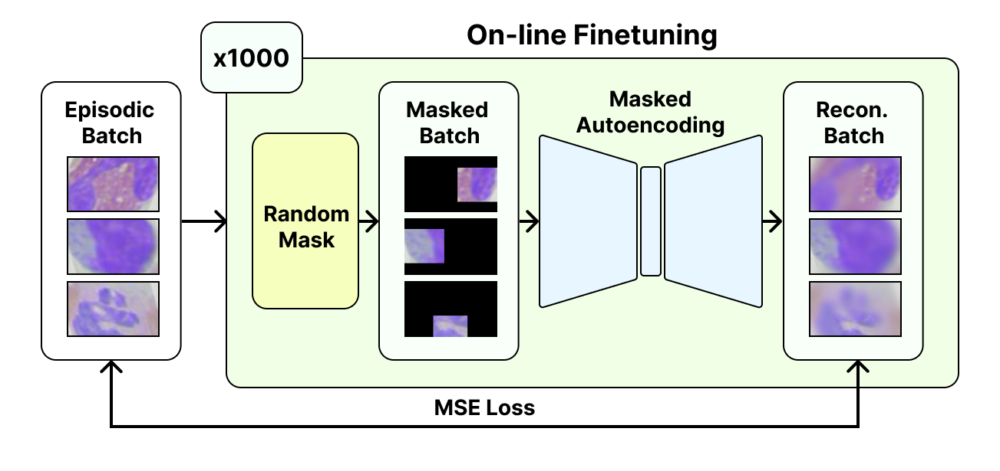
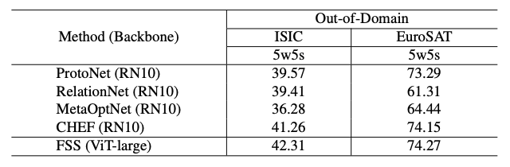
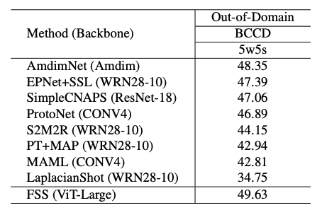

<h1 align="center">FSS</h1>

Fully Self-Supervised Masked Autoencoders for Out-of-domain Few-Shot Learning (FSS), a novel technique that adapts a vision transformer (ViT) to new domains through application of an on-line self-supervised finetuning session.



## Experiments

Test FSS on a range of out-of-domain datasets.

### Requirements

Install the requirements necessary for using FSS. A virtual environment (or similar) is recommended.

```bash
pip install -r requirements.txt
```

### Datasets

Datasets used in this work can be obtained at the following links:

- [BCCD WBC](https://www.kaggle.com/datasets/brikwerk/bccd-white-blood-cell)
- [ISIC, EuroSAT](https://github.com/yunhuiguo/CVPR-2021-L2ID-Classification-Challenges#track-1-cross-domain-small-scale)

After downloading all datasets, you should extract/place each respective dataset's folder in the same directory.

### Pretrained Weights

You can download MAE pretrained weights from [Meta's MAE Implementation](https://github.com/facebookresearch/mae#fine-tuning-with-pre-trained-checkpoints)

To use the pretrained weights, create a `fit_models` folder at the root of this repo and place all pretrained weights in it.

### Running Experiments

Run the `mae_test.sh`. To adjust parameters for a testing run, edit the number of shots, the finetuning iterations, image size, model type, model weights path, and the path to the root data directory (where you placed the downloaded datasets earlier).

To see a full list of available options, run the following command to see the help dialogue:

```
python3 mae_test.py --help
```

## In-Domain and Out-of-Domain Results



